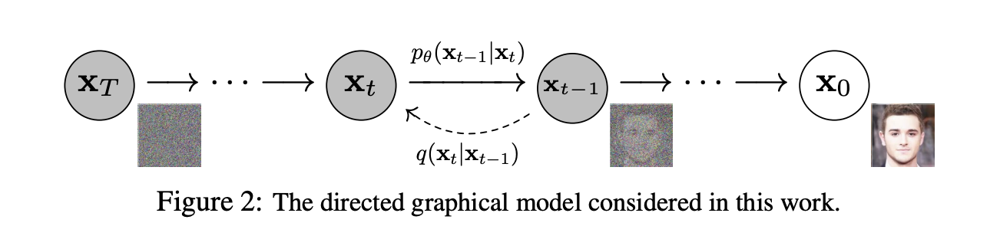

## Introduction to Diffusion Models

### What are they ?

Diffusion Models or more accurately, Denoising Diffusion Models are a class of generative ML models that produce new samples of data that matches a trained distribution by iteratively denoising a random noise sample.

### History

The current state of diffusion models is mostly derived from the work of [Ho et al.](https://arxiv.org/abs/2006.11239) who established that this class of ML models are capable of generating high quality images on par with GAN's. This was the DDPM a.k.a Denoising Diffusion Probabilistic Model.

### Core Idea:
1. It's possible to train a network to turn noise into a meaningful data sample i.e data generation can be restructured into a denoising problem.

### Denoising Diffusion Probabilistic Model

Let's take a look at the graphical model of the DDPM model.


The DDPM model can be described using 2 processes:

1. Forward Diffusion: This is a Markov chain where moving forward in time ( $0, 1, 2,...,T$ timesteps ) progressively adds gaussian noise to the image $X_0$ and finally as $T$ -> $\infty$ the image is just noise, $X_T$

    In the figure, $q$ represents the forward diffusion process and $q(x_t|x_{t-1})$ represents adding noise to $X_{t-1}$ to generate $X_t$ moving forward a single step in time.

2. Reverse Diffusion: This is another Markov chain but one that has learned to denoise the noisy image $X_T$ back into the original image $X_0$ by moving backward in time i.e from $(T, T-1,T-2,..1,0$ timesteps)

    The reverse diffusion process is represented by $p_{\theta}$. $\theta$ denotes that this is a particular learned reverse process. So if the reverse process has learnt to turn noise into pictures of cats, its parameters are $\theta_1$ and if it has learnt to generate dogs, its parameters are $\theta_2$ and so on. i.e $p_{\theta}$ is the learned reverse process to fit a given data distribution.

Mathematically:

1. Forward process:

<div align='center'>

$q(x_t|x_{t−1}) := \mathcal{N}(x_t; \sqrt{1 − \beta_{t}} x_{t−1}, \beta_{t}I)$
where,

$\beta_{t}$ is the forward process variance at timestep $t$

</div>

i.e the sample at the current timestep $x_t$ when the previous sample $x_{t-1}$ is known is generated by adding Gaussian noise to it. 

Extending this for the entire forward process,
<div align='center'>

$q(x_{1:T}| x_0 ) := \prod\limits_{t=1}^{T}q(x_t|x_{t-1})$


</div>

Also, this forward process allows generating a noisy sample at a random timestep $t$:

<div align='center'>

$q(x_t|x_0) := \mathcal{N}(x_t; \sqrt{\bar{\alpha_{t}}}x_0, (1-\bar{\alpha_t})I)$ where,

$\bar{\alpha_t} = \prod\limits_{s=1}^{t}\alpha_s$ 

$\alpha_t = 1-\beta_t$
</div>

[WIP]2. Reverse Process:

<!-- Placeholder for the math for reverse process -->

[WIP] Optimizing the loss

[WIP] Let's take a look at the code.
<!-- Link the code to DDPM pipeline huggingface-->
<!-- Explore the ddpm sampler in deep -->

[WIP] Train a DDPM on mini dataset like drawings

# ETA 9 June 2023


Important Notes:-
```
The dimensionality of the data and the latent variables is the same i.e if we're generating an image of size 256 x 256, the initial noise sample is also of size 256 x 256 and each intermediate sample that we progressively denoise is also of shape 256 x 256.
```
Glossary of Terms

* A Markov process is a stochaistic (random) process which lets you predict future outcomes based on its current state and nothing else. Expanding on this, a Markov chain is a set of states where each state can be predicted based on only its previous states and each state represents a system at a point of time.

* [Diffusion](https://en.wikipedia.org/wiki/Diffusion) is the net movement of anything (for example, atoms, ions, molecules, energy) generally from a region of higher concentration to a region of lower concentration.

    Rephrasing that to our scenario, Diffusion is a process by which information ( meaningful data ) is iteratively converted to noise over time. It then follows that reverse diffusion is the process by which noise is iteratively reconstructed into information, which in this case is an image.

Credits:
1. [Denoising Diffusion Probabilistic Models](https://arxiv.org/abs/2006.11239)
2. [Weng, Lilian. (Jul 2021). What are diffusion models? Lil’Log.](https://lilianweng.github.io/posts/2021-07-11-diffusion-models/)
3. [Markov Chains - University of Auckland](https://www.stat.auckland.ac.nz/~fewster/325/notes/ch8.pdf)
4. 